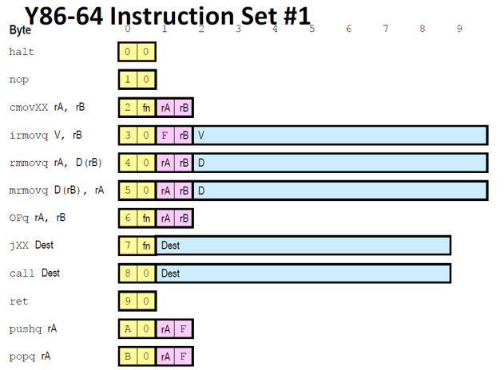
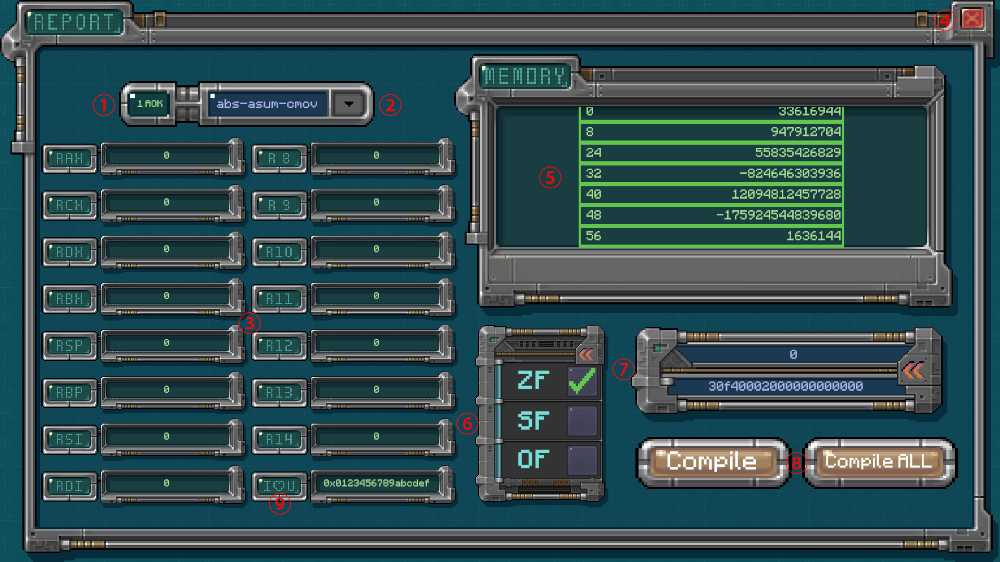

# ICSProject

简易CPU模拟器

## 项目简介

该作品基于Unity-C#开发，是一个GUI版的简易CPU模拟器，支持解释Y-86架构下的语句，是复旦大学2023秋《计算机系统基础》课程大作业。

## 环境依赖

Unity版本：2022.3.0f1c1（向上兼容）
开发工具：Visual Studio

## 界面介绍

以下是界面各部分的功能讲解：

* **①** STAT（运行状态）
* **②** 文件选择下拉栏
* **③** REG（寄存器）
* **④** 退出按钮
* **⑤** 内存一览（以地址：8个byte按照小端存储方式转换成十进制数据格式表示）
* **⑥** CC（条件码）
* **⑦** PC（上方为指令计数器，下方为对应的指令）
* **⑧** 编译按钮（左边为执行一条指令，右边为执行到STAT不等于1）
* **⑨** 一个可爱的笨蛋寄存器

## 项目贡献度

袁枫翔：前端设计，代码框架
王浩宇：代码功能校正
